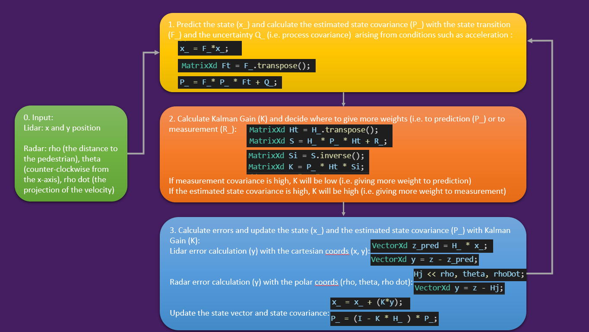

# Project: Extended Kalman Filter

## Introduction

The purpose of this project is to implement both vanilla and extended Kalman Filter to estimate the state vector of a moving object of interest around a simulated vehicle. The input data is generated by the combination of Lidar (x and y coordinates) and Radar (rho, phi and rho dot).


The output is the continuous values of Root Mean Square Error, which indicate how good or bad the Kalman Filter provided the estimation. 


Since it is an error, the lower the values are, the better the performance is.

## Core files under /src in this project

* FusionEKF.cpp - this file documents a class to process Lidar and Radar data to estimate the state vector through the methods of Initialisation, Process Measurement, Predict, and Update.
* kalman_filter.cpp - this file includes a step by step process of calculating Kalman Filter estimation - mainly how to calculate prediction, compute Kalman Gain to weigh bewteen predicted values and measurement values, and update the final state vector and state covariance matrix for the next stage of Kalman Filter process.
* tools.cpp - this sorce file contains a class having two calculation methods - RMSE calculation and Jacobian matrix calculation. Jacobian matrix is used for linear approximation.

## Quick Start

The most instructions below are specified by Udacity program to make the installation process less painful - I have to say, it was still painful to install and check all dependencies working correctly.

### Install packages

1. This project involves the Term 2 Simulator which can be downloaded [here](https://github.com/udacity/self-driving-car-sim/releases).

2. If your operating system is Windows, I recommend you to download Docker. Instructions can be found [here](https://docs.docker.com/toolbox/toolbox_install_windows/). Then, launch the Docker Quickstart Terminal. The default Linux virtual environment should load up. You can test that Docker is setup correctly by running docker version and docker ps.

You can enter a Docker image that has all the project dependencies by running:

docker run -it -p 4567:4567 -v ${pwd}:/src udacity/controls_kit:latest

Once inside Docker you can clone over the GitHub project repositories and run the project from there.

3. If you decided not to install Docker, the following dependencies have to be resolved:

* uWebSocketIO = branch e94b6e1, only uWebSocketIO branch e94b6e1, which the scripts reference, is compatible with the package installation.
  * [click here for installation instructions](https://github.com/uNetworking/uWebSockets)
* cmake >= 3.5
  * All OSes: [click here for installation instructions](https://cmake.org/install/)
* make >= 4.1 (Linux, Mac), 3.81 (Windows)
  * Linux: make is installed by default on most Linux distros
  * Mac: [install Xcode command line tools to get make](https://developer.apple.com/xcode/features/)
  * Windows: [Click here for installation instructions](http://gnuwin32.sourceforge.net/packages/make.htm)
* gcc/g++ >= 5.4
  * Linux: gcc / g++ is installed by default on most Linux distros
  * Mac: same deal as make - [install Xcode command line tools](https://developer.apple.com/xcode/features/)
  * Windows: recommend using [MinGW](http://www.mingw.org/)

### Run the simulator and build in the docker

When you want to see the RMSE results in the simulator, you will have to run your simulator first before running the built project. In my case, I just needed to start the _term2_sim.exe_ execution file in the _term2_sim_windows_ simulator file that I downloaded as part of the previous step.

If you install everything correctly, the main program can be built and run by doing the following from the project top directory (i.e. where you can see _CMakeLists.txt_ file).

```
mkdir build && cd build //create a directory and go into the directory
cmake .. && make //in the 'build' directory, compile the project
./ExtendedKF //run the built project
```
If everything worked well, after these steps, you will see the following messages on your terminal.


Press _Start_ button. If everything worked correctly, you will see on the simulator screen that a car start to drive around and your RMSE values will be changed according to Kalman Filter estimations.

---

## Kalman Filter Process

The process of implementing Kalman Filter at first glimpse seems to be quite convoluted. However



## Results

There are two datasets (i.e. Dataset 1, Dataset 2) to test the estimation of Extended Kalman Filter.

The result below is on the first dataset.


And the result on the second dataset.

